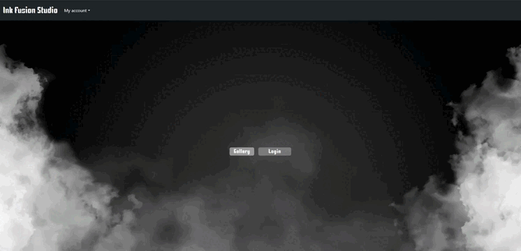

<p align="center">☠✒Estudio de Tatuajes Frontend✒☠</p>



<p align="center">Proyecto del Bootcamp de Full Stack Developer de Geekshubs Academy.</p>

## Contenidos del Readme

- ### 🚀 [Descripcion](#Descripción)
- ### 🛠️ [Tecnologías Utilizadas](#Tecnologías-utilizadas)
- ### 🎯 [Funcionalidades](#Funcionalidades)
- ### ⚙️ [Instrucciones de uso](#Intrucciones-de-uso)
- ### 🌟 [Mejoras](#Mejoras)
- ### 📧 [Contribuciones](#Contribuciones)

---
## Descripción 

**Ink Fusion Studio** es un proyecto que recrea el frontend de un estudio de tatuajes con un sistema de gestión de citas. Forma parte del quinto proyecto del Bootcamp Full Stack Developer en GeeksHubs Academy. La aplicación permite a los usuarios registrarse, realizar login, acceder a su área de cliente y gestionar citas con tatuadores. Además, proporciona funcionalidades específicas para el administrador, como la gestión de usuarios y citas. El objetivo principal es crear una plataforma que permita a clientes, trabajadores y administradores acceder a información relevante según su rol específico.

---
## Tecnologías utilizadas:

[]()
[]()
[]()
[]()
[]()

---
## Funcionalidades

#### Registro y Autenticación de Usuarios
Permite a los usuarios registrarse e iniciar sesión de manera segura.

#### Perfil de Usuario
Cada cliente, tatuador y administrador contará con un perfil de usuario personalizado donde podrán visualizar y editar sus datos personales.

#### Citas
Los clientes tendrán acceso a una vista que mostrará su historial de sus citas. Donde pondrá tanto crear, como editar y elimar dichas citas.

#### Vista Tatuadores
Los tatuadores podrán acceder como trabajadores, y en la vista de citas podrán visualizar las citas.

#### Vista Administrador
El administrador tendrá acceso a la información de todos los usuarios y citas en la aplicación. Se podrán realizar operaciones de edición y borrado de usuarios y citas para gestionar el estudio.

---
## Instrucciones de uso

### Clonar Repositorio

```jsx
 git clone https://github.com/RichardSGadea/InkFusionStudio-frontend.git

```

### Instalación de Dependencias

1. Entra en la carpeta del proyecto:
    
    ```bash
    cd nombre_de_la_carpeta
    
    ```
    
2. Instala las dependencias utilizando npm:
    
    ```bash
    npm i
    
    ```

### Backend
Este proyecto depende del backend para el funcionamiento. Asegurarse de tener el backend clonado y en ejecución antes de iniciar la aplicación frontend. Su código fuente se encuentra en el siguiente repositorio: [Backend Repository](https://github.com/RichardSGadea/InkFusionStudio-backend.git).

Una vez instaladas las dependencias y con el backend ejecutandose, inicia la aplicación.


---
## Mejoras
- Crear nuevas vistas en las que poder hacer que sea una web más completa y funcional.
- Implementar el CRUD de portfolio para mostrar diferentes tatuajes. 
- Que el admin pueda hacer que cualquier usuario sea trabajador o otro admin.  
- Control mejorado de fechas de citas.

## Contribuciones
Si alguien desea contribuir en el desarrollo de este frontend, puede ponerse en contacto con nosotros en richardsgadea@gmail.com o le invitamos a abrir un [Issue](https://github.com/RichardSGadea/InkFusionStudio-frontend/issues) o enviar una [Pull request](https://github.com/RichardSGadea/InkFusionStudio-frontend/pulls)
